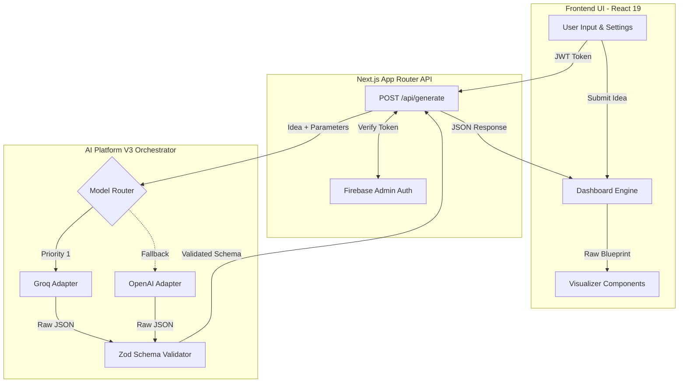
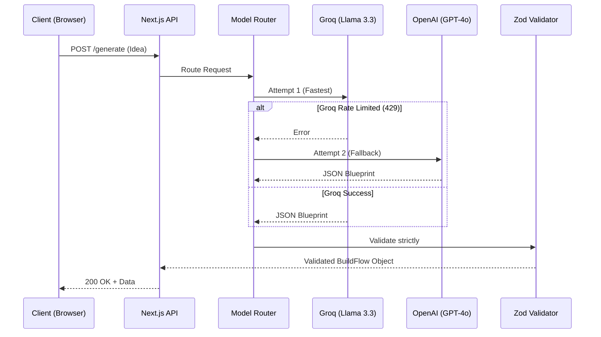
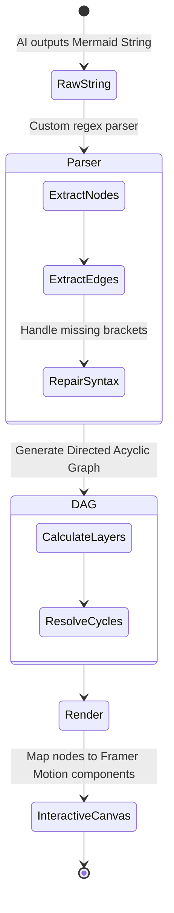
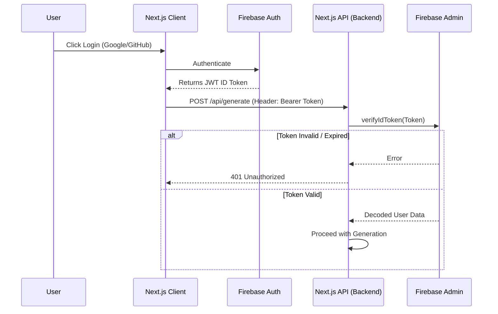

<div align="center">
  
  <h1>BuildFlow AI</h1>
  <p><strong>From Idea to Enterprise Architecture in Seconds</strong></p>
  
  [](https://nextjs.org/)
  [](https://www.typescriptlang.org/)
  [](https://tailwindcss.com/)
  [](https://groq.com/)
  [](https://firebase.google.com/)
  
  <p>
    An intelligent, context-aware platform that transforms natural language software ideas into complete, highly-detailed, and production-ready architectural blueprints using Large Language Models.
  </p>
</div>

---

## 🌟 Overview

**BuildFlow AI** acts as your Principal Software Architect. Instead of spending weeks planning system design, database schemas, and engineering roadmaps, simply describe your software idea to BuildFlow. 

The platform utilizes a highly optimized LLM orchestration engine to generate a complete Software Development Life Cycle (SDLC) blueprint, outputting everything from microservice container strategies to granular REST API definitions.

---

## 🏗 System Architecture

BuildFlow-AI is built on a resilient, multi-tiered architecture powered by Next.js and a custom AI orchestration engine. The diagram below illustrates the end-to-end data flow from the moment a user submits an idea to the moment the visualization renders.



---

## ✨ Core Features & Technical Deep Dives

### 1. Intelligent AI Orchestration (Platform V3)
BuildFlow uses a **Cascade Routing System**. If a primary provider (like Groq) hits a rate limit or times out, the platform seamlessly fails over to an alternative model, ensuring zero downtime for the user.



### 2. Interactive AI Visualizations (Fault-Tolerant Engine)
Because Large Language Models can sometimes hallucinate invalid syntax when writing Mermaid diagrams, BuildFlow features a custom **Fault-Tolerant Parser**. The frontend gracefully isolates valid nodes and edges from malformed strings and builds a Directed Acyclic Graph (DAG) for rendering.



### 3. Secure Firebase Authentication
Every user session is secured using Firebase Authentication. The Next.js API endpoints are strictly guarded using Firebase Admin to verify JWT tokens on the backend before any LLM generation begins, preventing quota abuse.



### 4. Dynamic Detail Scaling
Choose the exact level of architectural depth you need:
- **Standard Mode:** Perfect for rapid prototyping. Outputs concise, rate-limit friendly blueprints (~2,500 tokens).
- **Enterprise Mode:** Designed for massive scale. Outputs deep documentation, complex scaling strategies, and granular database indexing rules (~8,000 tokens).

---

## 📂 Project Structure

A high-level view of the repository's organization:

```text
BuildFlow-AI/
├── app/                      # Next.js 15 App Router pages & API endpoints
│   ├── (app)/                # Authenticated application routes (Dashboard, etc.)
│   ├── api/generate/         # AI Generation POST endpoint
│   └── page.tsx              # Landing page
├── components/               # Reusable React components
│   ├── dashboard/            # Blueprint visualization cards (Overview, API, etc.)
│   ├── landing/              # Hero, Navbar, Input components
│   └── shared/               # Custom Diagram renderer and UI library
├── lib/
│   ├── ai/                   # Core AI Platform V3 Orchestrator & Adapters
│   └── firebase/             # Authentication configuration (Client & Admin)
├── prompts/                  # LLM Prompt Engineering files (buildflow.prompt.ts)
├── store/                    # Zustand state management
└── types/                    # Zod schemas and TypeScript interfaces
```

---

## 🚀 Getting Started

### Prerequisites

- **Node.js** (v18 or higher)
- **Groq API Key** (Get it [here](https://console.groq.com/keys))
- **Firebase Project** (For authentication setup)

### 1. Clone & Install

```bash
git clone https://github.com/Omkar2005494/BuildFlow-AI.git
cd BuildFlow-AI
npm install
```

### 2. Environment Variables

Create a `.env.local` file in the root directory. You will need your Firebase project credentials and your LLM provider keys.

```env
# AI Providers
GROQ_API_KEY="your_groq_api_key_here"
# OPENAI_API_KEY="optional_fallback_key"

# Firebase Client (Frontend Authentication)
NEXT_PUBLIC_FIREBASE_API_KEY="your_api_key"
NEXT_PUBLIC_FIREBASE_AUTH_DOMAIN="your_domain"
NEXT_PUBLIC_FIREBASE_PROJECT_ID="your_project_id"

# Firebase Admin (Backend Token Verification)
FIREBASE_PRIVATE_KEY="your_private_key"
FIREBASE_CLIENT_EMAIL="your_client_email"
```

### 3. Run the Development Server

```bash
npm run dev
```

Navigate to [http://localhost:3000](http://localhost:3000) in your browser. Log in, select your generation mode (Standard or Enterprise), and bring your software ideas to life!

---

## 🛠 Advanced Configuration

### Adding New AI Providers
BuildFlow's `AI Platform V3` uses a plug-and-play Adapter pattern. To add a new provider (e.g., Cohere):
1. Create `cohere.adapter.ts` in `lib/ai/providers/`.
2. Implement the `BaseAdapter` interface.
3. Register it in `lib/ai/platform.ts`: `this.registerAdapter(new CohereAdapter())`.

---

## 🤝 Contributing

Contributions make the open-source community an amazing place to learn, inspire, and create. Any contributions you make are **greatly appreciated**.

1. Fork the Project
2. Create your Feature Branch (`git checkout -b feature/AmazingFeature`)
3. Commit your Changes (`git commit -m 'Add some AmazingFeature'`)
4. Push to the Branch (`git push origin feature/AmazingFeature`)
5. Open a Pull Request

## 📄 License

Distributed under the MIT License. See `LICENSE` for more information.
